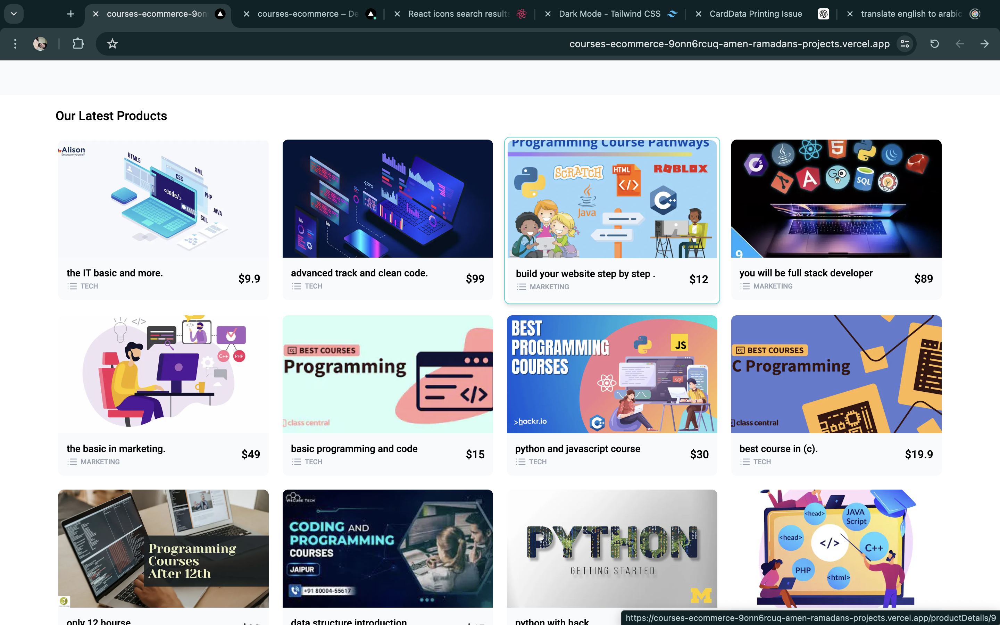
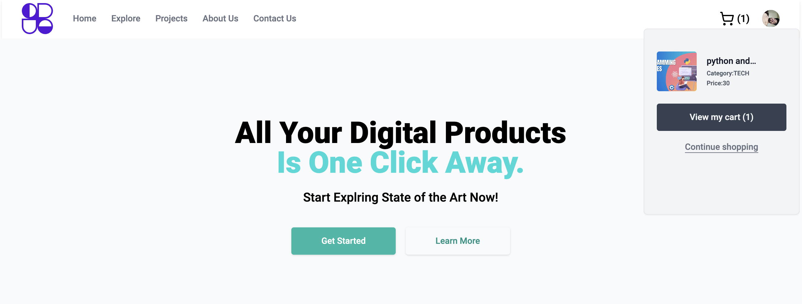
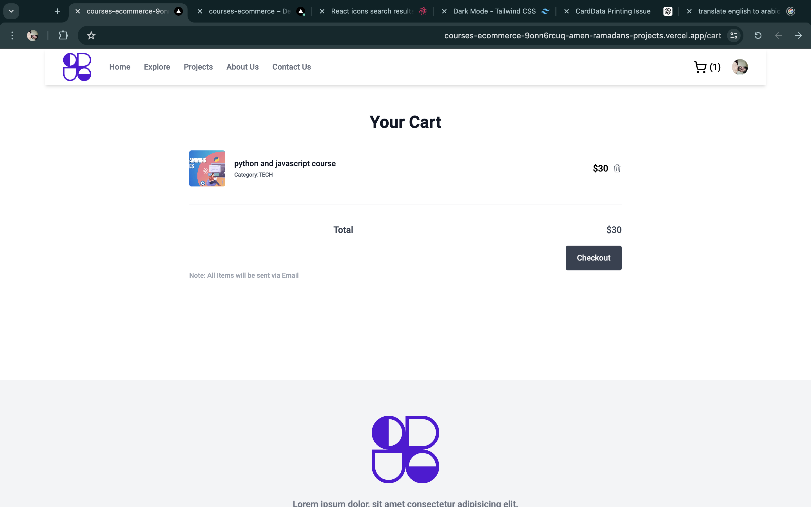
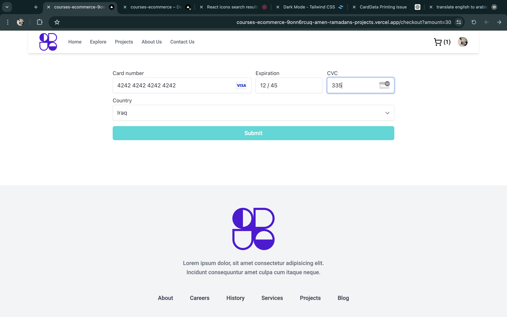
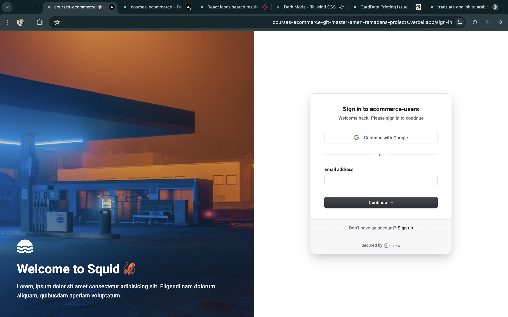
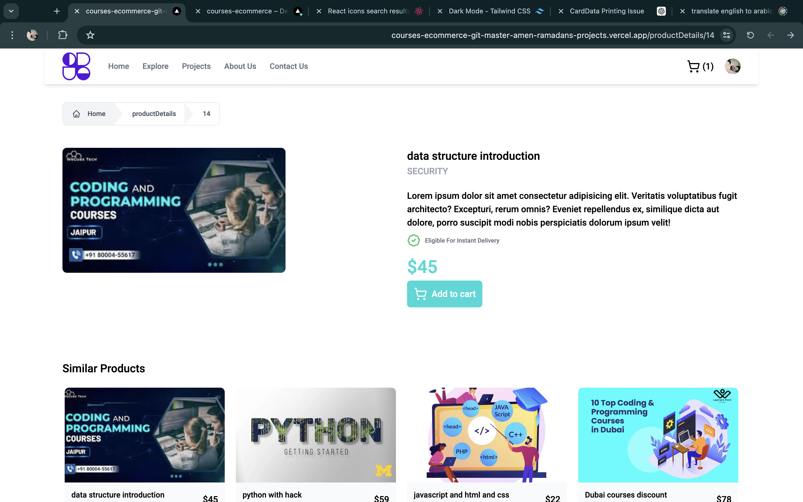

# Project: ecommerce-courses

## Description:
A comprehensive e-commerce project built from scratch using React and TypeScript. The project features a robust backend relying on a CMS system and Stripe for payment processing. Below are the key components and functionalities of the project:

### Backend:
- **CMS System**: Utilizes Stripe for payment processing.
- **Databases**: Built using PostgreSQL and deployed on Render.
- **Cloud Services**: Integrates with Cloudinary for managing product images.

### Frontend:
- **Product Browsing**: Products are fetched from the database and displayed, leveraging cloud services.
- **Order Processing**: Users can place orders, and the order data is stored in the database. The page can be refreshed without losing order data.

### Payment System:
- **Stripe Integration**: Secure payment processing with data validation.
- **Email Notifications**: Uses the Resend library to send order confirmation emails containing purchase details.

### User Management:
- **Authentication**: Includes login and registration functionality.
- **Authorization**: Middleware checks for user permissions to ensure secure access control.

### Note:
- **Demo Availability**: The demo may not be available as the free period provided by Render for the hosted databases has expired.

This project showcases a fully functional e-commerce platform with a range of features and integrations, making it a solid example of a modern web application.