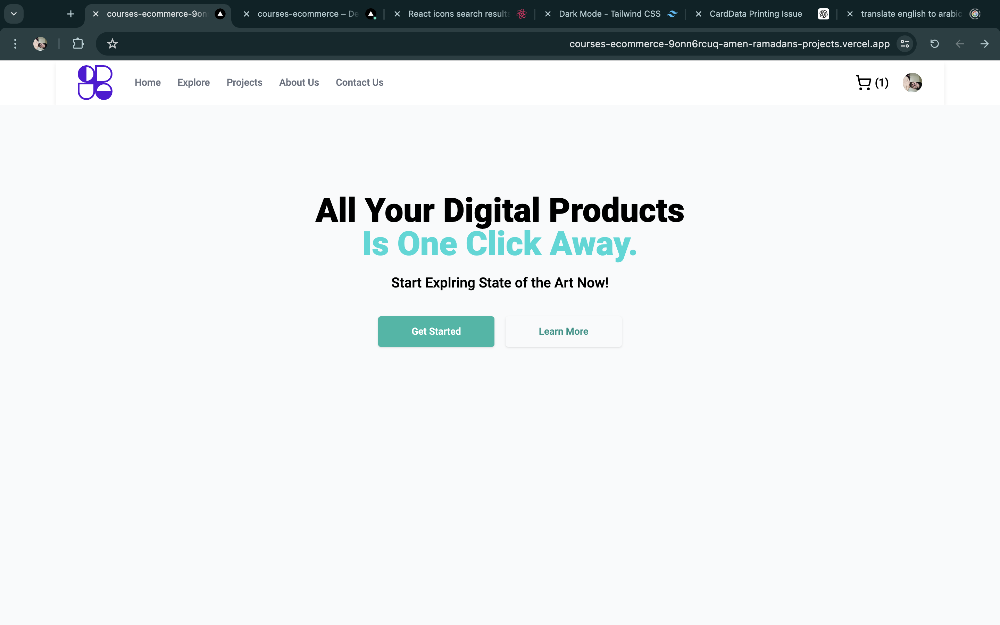
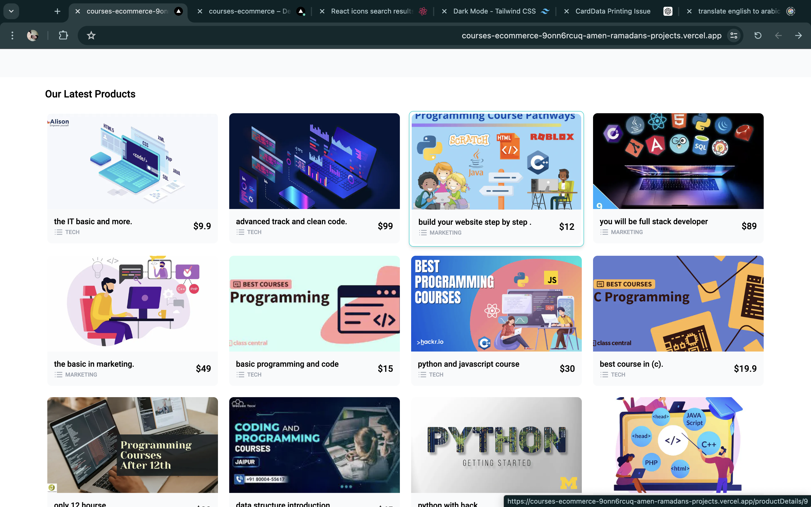
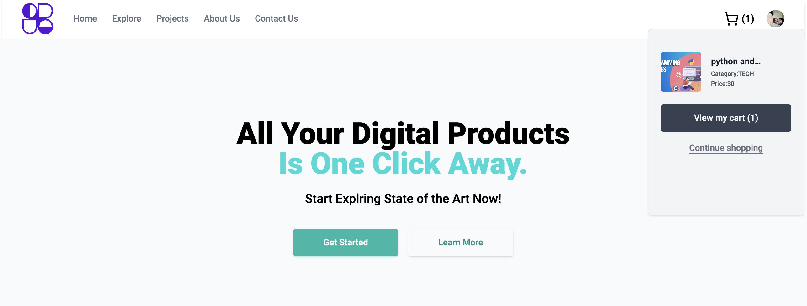
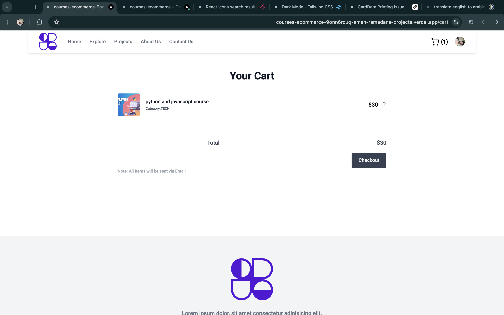
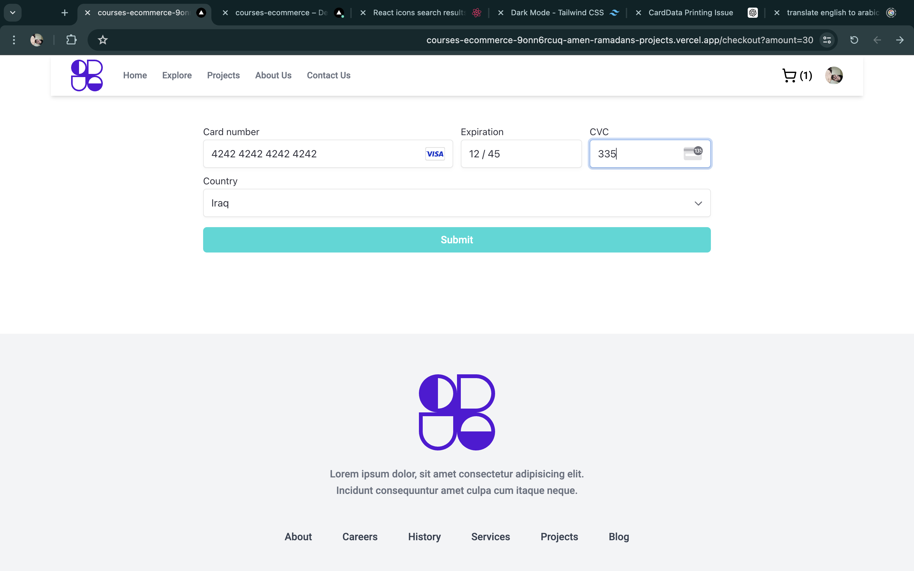
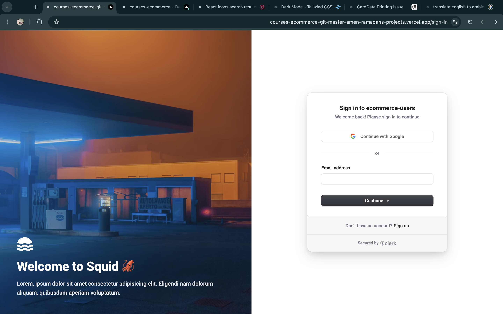

# Next.js E-commerce Platform

[](https://nextjs.org)
[](https://www.typescriptlang.org)
[](https://tailwindcss.com)

A modern, full-stack e-commerce platform built with Next.js 14, TypeScript, and Stripe integration. This project showcases a complete e-commerce solution with advanced features and a responsive design.

## Description:
A comprehensive e-commerce project built from scratch using React and TypeScript. The project features a robust backend relying on a CMS system and Stripe for payment processing. Below are the key components and functionalities of the project:

### Backend:
- **CMS System**: Utilizes Stripe for payment processing.
- **Databases**: Built using PostgreSQL and deployed on Render.
- **Cloud Services**: Integrates with Cloudinary for managing product images.

### Frontend:
- **Product Browsing**: Products are fetched from the database and displayed, leveraging cloud services.
- **Order Processing**: Users can place orders, and the order data is stored in the database. The page can be refreshed without losing order data.

### Payment System:
- **Stripe Integration**: Secure payment processing with data validation.
- **Email Notifications**: Uses the Resend library to send order confirmation emails containing purchase details.

### User Management:
- **Authentication**: Includes login and registration functionality.
- **Authorization**: Middleware checks for user permissions to ensure secure access control.

### Note:
- **Demo Availability**: The demo may not be available as the free period provided by Render for the hosted databases has expired.

## 🚀 Features

- 🔐 Secure authentication with Clerk
- 💳 Stripe payment integration
- 🛍️ Product catalog with filtering and search
- 🛒 Shopping cart functionality
- 📧 Order confirmation emails
- 📱 Fully responsive design
- 🔍 Advanced search capabilities
- 📊 Real-time inventory management

## 📸 Project Screenshots

<div style="display: flex; justify-content: center; gap: 20px; margin: 20px 0;">
  
  
  
</div>

<div style="display: flex; justify-content: center; gap: 20px; margin: 20px 0;">
  
  
  
</div>

## 🛠️ Tech Stack

- **Frontend**: Next.js 14, TypeScript, Tailwind CSS
- **Authentication**: Clerk
- **Payment Processing**: Stripe
- **Email Service**: Resend
- **Icons**: Lucide React
- **API Client**: Axios

## 📦 Installation

1. Clone the repository:
```bash
git clone [repository-url]
cd ecommerce-next
```

2. Install dependencies:
```bash
npm install
```

3. Create a `.env.local` file with the following variables:
```
NEXT_PUBLIC_CLERK_PUBLISHABLE_KEY=your_key
NEXT_PUBLIC_CLERK_SIGN_IN_URL=/sign-in
NEXT_PUBLIC_CLERK_SIGN_UP_URL=/sign-up
NEXT_PUBLIC_CLERK_AFTER_SIGN_IN_URL=/
NEXT_PUBLIC_CLERK_AFTER_SIGN_UP_URL=/
NEXT_PUBLIC_STRIPE_PUBLISHABLE_KEY=your_key
STRIPE_SECRET_KEY=your_key
RESEND_API_KEY=your_key
```

4. Start the development server:
```bash
npm run dev
```

## 🚀 Running the Project

- Development: `npm run dev`
- Build: `npm run build`
- Start production: `npm run start`
- Lint: `npm run lint`